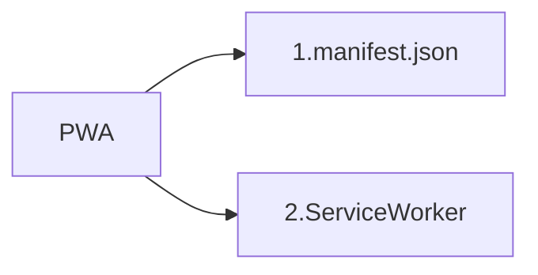
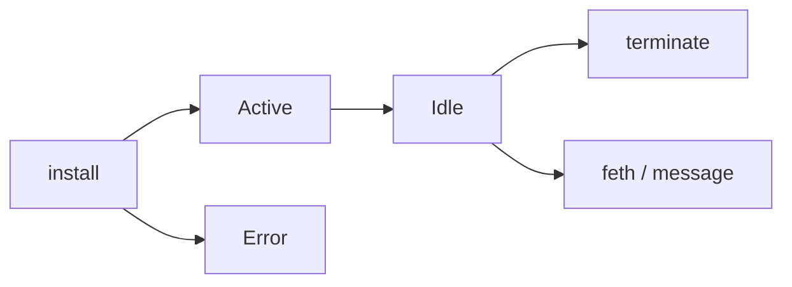

# Progressive Web App

PWA(progressive web app) เป็นเทคโนโลยีที่จะทำให้เว็บของเรา มีความใกล้เคียงกับแอปพลิเคชันบนมือถือมากยิ่งขึ้น รวมถึงการใช้งานเมื่ออยู่ใน Mode Offline, การทำ Push Notification, อัพเดทกันได้ทันที ไม่ต้องอัพโหลดขึ้น Store และไม่ต้อง Install ให้ยุ่งยาก้ยุ่งยาก

## ส่วนประกอบของ progreesive web app



#### 1. manifast.json

manifast.json เป็นไฟล์ JSON ที่เราใส่เข้าไปใน head ของ html ไว้กำหนดค่าต่างๆของแอปพลิเคชัน เช่น

- ไอคอน Add to homescreen
- ควบคุมมุมมองแนวตั้ง แนวนอน
- โทนสี
- หน้า Splash screen

```json
{
  "name": "PWA",
  "short_name": "PWA",
  "start_url": "/index.html",
  "display": "standalone",
  "orientation": "portrait",
  "background_color": "#2F3BA2",
  "theme_color": "#2F3BA2",
  "gcm_sender_id": "852130693394",
  "icons": [
    {
      "src": "/images/icons/icon-128x128.png",
      "sizes": "128x128"
    },
    {
      "src": "/images/icons/icon-144x144.png",
      "sizes": "144x144"
    },
    {
      "src": "/images/icons/icon-152x152.png",
      "sizes": "152x152"
    },
    {
      "src": "/images/icons/icon-192x192.png",
      "sizes": "192x192"
    },
    {
      "src": "/images/icons/icon-256x256.png",
      "sizes": "256x256"
    },
    {
      "src": "/images/icons/icon-512x512.png",
      "sizes": "512x512"
    }
  ]
}
```

#### 2. ServiceWorker

ServiceWorker คือ การกำหนดให้ Cache ส่วนต่างๆที่จำเป็นในเว็บของเราไว้ ซึ่งเราสามารถกำหนดได้ว่าจะให้ Cache ส่วนไหนบ้าง หรือไม่ Cache ส่วนไหน

###### service worker life cycle



## ตัวอย่างการทำงานของ service worker

#### install event

ขั้นตอนนี้จะเกิดครั้งแรก ทำหน้าที่จัดการ cache จำพวก css, images, fonts, js, templates เป็นต้น


ตัวอย่าง code

```javascript
self.addEventListener("install", function(event) {
  event.waitUntil(
    caches.open("mysite-static-v3").then(function(cache) {
      return cache.addAll([
        "/css/whatever-v3.css",
        "/css/imgs/sprites-v6.png",
        "/css/fonts/whatever-v8.woff",
        "/js/all-min-v4.js"
        // etc
      ]);
    })
  );
});
```

#### activate event

ขั้นตอนนี้จะเกิดขึ้นขณะเราใช้งาน ทำหน้าที่จัดการลบ cache เก่าที่เราต้องการ


ตัวอย่าง code

```javascript
self.addEventListener("activate", function(event) {
  event.waitUntil(
    caches.keys().then(function(cacheNames) {
      return Promise.all(
        cacheNames
          .filter(function(cacheName) {
            // Return true if you want to remove this cache,
            // but remember that caches are shared across
            // the whole origin
          })
          .map(function(cacheName) {
            return caches.delete(cacheName);
          })
      );
    })
  );
});
```

#### fetch event

ขั้นตอนนี้จะเกิดขึ้นหลังจาก เปิดเว็บไซต์ครั้งแรกหรือรีเฟรช (install แล้ว) ทำหน้าที่อัพเดต cache


ตัวอย่าง code

```javascript
self.addEventListener("fetch", function(event) {
  event.respondWith(
    caches.open("mysite-dynamic").then(function(cache) {
      return cache.match(event.request).then(function(response) {
        return (
          response ||
          fetch(event.request).then(function(response) {
            cache.put(event.request, response.clone());
            return response;
          })
        );
      });
    })
  );
});
```

#### push event

ขั้นตอนนี้จะเกิดเมื่อมีการ push notification กรณีที่เรา subscribe ไว้


ตัวอย่าง code

```javascript
self.addEventListener("push", function(event) {
  const title = "Push Codelab";
  const options = {
    body: "Yay it works.",
    icon: "images/android-desktop.png",
    badge: "images/badge.png"
  };

  event.waitUntil(self.registration.showNotification(title, options));
});
```

# Push notification

Push Notification หรือ การแจ้งเตือน คือ การที่แอปพลิเคชันนำข้อมูลมาแสดงในแถบแจ้งเตือนของระบบปฏิบัติการนั้นๆ กำหนด ไม่ว่าจะเป็น Mobile(iOS, Android) หรือ browser ในปัจจุบันก็สามารถแสดงแถบแจ้งเตือนได้แล้ว

#### Local Notification

แอปพลิเคชันแสดง notification เอง ไม่มีอะไรเกี่ยวข้องกับ server ใดๆ ปกติแล้วจะแยกได้อีก 2 แบบย่อย คือ แจ้งเตือนตามเวลาที่กำหนด และแจ้งเตือนเป็นรอบๆ เช่น แอปนาฬิกาปลุก แอปแจ้งเตือนนัดหมาย เป็นต้น

#### Remote Notification

แอปพลิเคชันรับข้อมูลมาจาก server แบบไม่จำเป็นต้อง request ไปก่อน ตัวอย่าง โปรแกรมแชท ต่างๆ

#### Cloud Messaging Server หรือ Push Server

เป็นบริการที่ทำให้เราสามารถส่ง Push Notification ได้ แต่ละเจ้าก็อาจมีขนาดของข้อมูลที่จะส่ง ความสามารถ วิธีการส่ง แตกต่างกันออกไป

- FCM - Firebase Cloud Messaging เป็นบริการจาก Google ที่พัฒนาต่อยอดจาก GCM (Google Cloud Messaging) จากเดิมที่ออกแบบมาเพื่อ Android ปัจจุบันสามารถรองรับทั้ง Android, iOS, Web

- APNS - Apple Push Notification Service เป็นบริการจาก Apple ก็จะส่งได้แค่ Apple 😩 :trollface:

## การ Web Push Notification โดยใช้ FCM

เว็บบราวเซอร์รองรับ

| Browser | 📱Mobile  | 💻 Desktop |
| ------- | ------ | ------- |
| Chrome  | ✅     | ✅      |
| Firefox | ✅     | ✅      |
| Opera   | ✅     | ✅      |
| Safari  | ✖️     | ✖️      |

####
