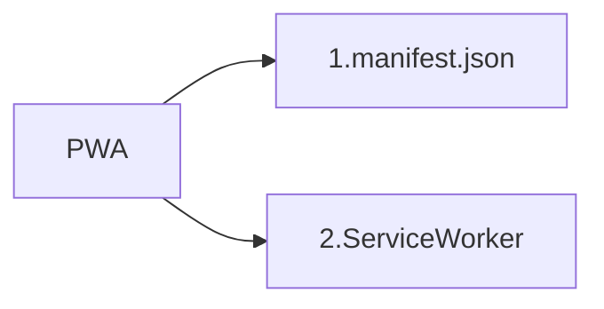

# Progressive Web App

PWA(progressive web app) เป็นเทคโนโลยีที่จะทำให้เว็บของเรา มีความใกล้เคียงกับแอปพลิเคชันบนมือถือมากยิ่งขึ้น รวมถึงการใช้งานเมื่ออยู่ใน Mode Offline, การทำ Push Notification, อัพเดทกันได้ทันที ไม่ต้องอัพโหลดขึ้น Store และไม่ต้อง Install ให้ยุ่งยาก้ยุ่งยาก

#### ส่วนประกอบของ progreesive web app



#### 1. manifast.json

manifast.json เป็นไฟล์ JSON ที่เราใส่เข้าไปใน head ของ html ไว้กำหนดค่าต่างๆของแอปพลิเคชัน เช่น

- ไอคอน Add to homescreen
- ควบคุมมุมมองแนวตั้ง แนวนอน
- โทนสี
- หน้า Splash screen

###### ตังอย่าง manifast.json

```json
{
  "name": "PWA",
  "short_name": "PWA",
  "start_url": "/index.html",
  "display": "standalone",
  "orientation": "portrait",
  "background_color": "#2F3BA2",
  "theme_color": "#2F3BA2",
  "gcm_sender_id": "852130693394",
  "icons": [
    {
      "src": "/images/icons/icon-128x128.png",
      "sizes": "128x128"
    },
    {
      "src": "/images/icons/icon-144x144.png",
      "sizes": "144x144"
    },
    {
      "src": "/images/icons/icon-152x152.png",
      "sizes": "152x152"
    },
    {
      "src": "/images/icons/icon-192x192.png",
      "sizes": "192x192"
    },
    {
      "src": "/images/icons/icon-256x256.png",
      "sizes": "256x256"
    },
    {
      "src": "/images/icons/icon-512x512.png",
      "sizes": "512x512"
    }
  ]
}
```

#### 2. ServiceWorker
ServiceWorker คือ การกำหนดให้ Cache ส่วนต่างๆที่จำเป็นในเว็บของเราไว้ ซึ่งเราสามารถกำหนดได้ว่าจะให้ Cache ส่วนไหนบ้าง หรือไม่ Cache ส่วนไหน